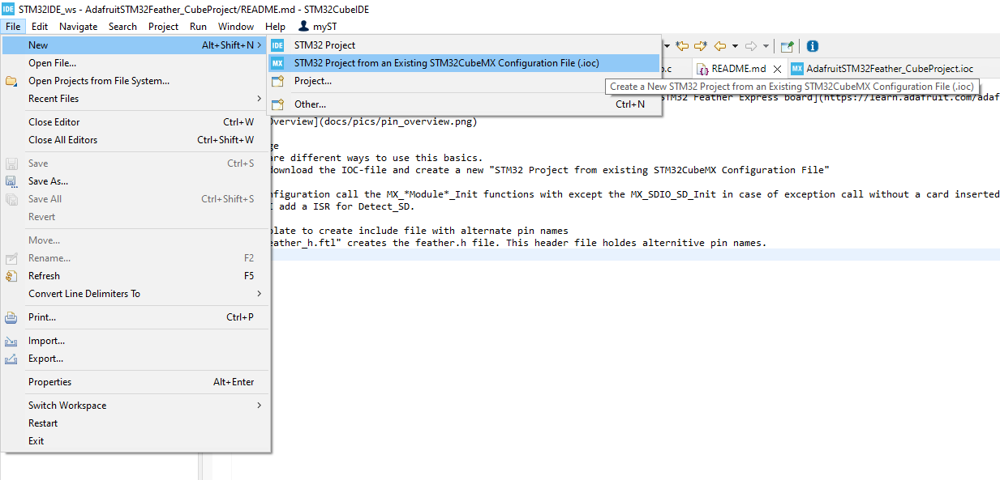

# Adafruit STM32Feather Express CubeIDE Project 
This is a project to create a basic STM32CubeIDE project for the [Adafruit STM32 Feather Express board](https://learn.adafruit.com/adafruit-stm32f405-feather-express).
All pins are assigned like the standard usage.

## Usage
There are different ways to use this basics.
1. First at all you can use a cope/branch of this repro.
2. Download the IOC-file and create a new "STM32 Project from existing STM32CubeMX Configuration File"
    
    
Today the configuration is very basic and untestet. I have added all peripherals like intend from the Feather manual.

The configuration calls all MX_*Module*_Init functions with except the MX_SDIO_SD_Init in case of exception call without a card inserted.
Maybe I add a ISR for Detect_SD. 

## Template to create include file with interchangeable pin names
There is a "feather_h.ftl" template. It creates the feather.h file. This header file holdes alternative pin names.
The #include of this header file is inside a user section.
